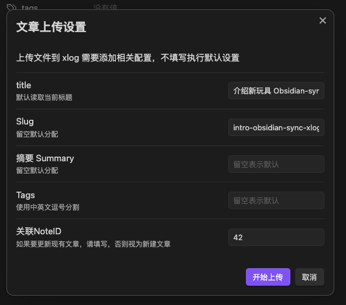
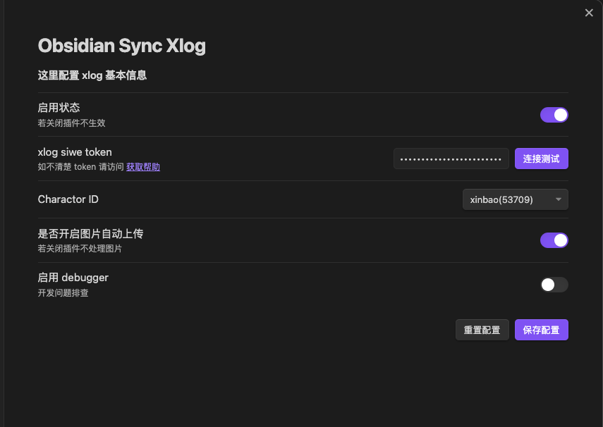
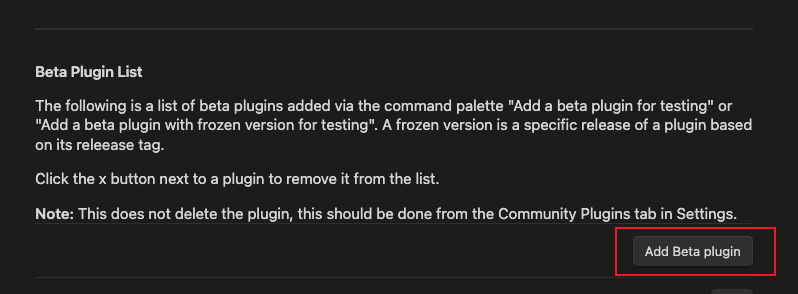
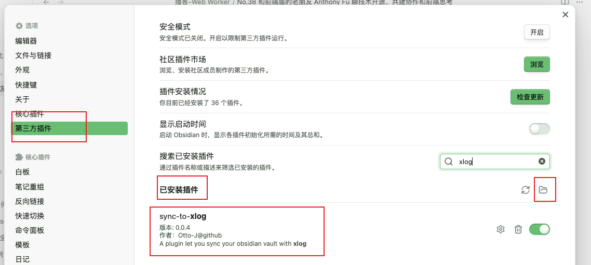

# Sync To Xlog

An Obsidian plugin that syncs notes to xlog.app.
一个 Obsidian 插件，可以把笔记同步到 xlog.app 上。

# 相关截图

上传弹窗



设置截图



## 安装
### 通过社区插件市场安装

目前本插件已经通过 obsidian 官方上线，可以直接在第三方插件搜索xlog。


也可以通过 BRAT 安装（类似于 iOS TestFlight），或者手动安装

### 通过 BRAT 安装

打开设置 - 第三方插件 - 浏览 - 搜索 brat，下载安装并启用。


打开 BRAT 设置


点击 Add Beta plugin
有个弹窗，填写这个网址


```text
https://github.com/Otto-J/sync-to-xlog
```

点击 `Add Plugin`


### 手动安装（不再推荐）

访问 <https://github.com/Otto-J/sync-to-xlog/releases> 下载最新 dist.zip 文件夹，放入插件目录

设置 - 第三方插件 - 已安装插件右侧有个文件夹图标。解压后放入即可。



## 使用教程

### 视频教程

见 B 站 [《介绍我开发的 Obsidian-sync-xlog 插件：轻松帮你同步 obsidian 内容到 xlog 上》](https://www.bilibili.com/video/BV1rQ4y1s7Fa/)

### 文字教程

启用插件后，[获取 token](https://blog.ijust.cc/play-xlog-02)并连接测试成功
选择发布内容的账号（同一 token 可绑定多个账号）


在 Obsidian 中右键文件，选择`上传此文件到xlog`


编辑相关设置后，点击`上传`


## 当前进展

等待 obsidian 官方上线本插件

项目背景和程序设计可以访问 <https://blog.ijust.cc/play-xlog-03>

目前已实现功能：

- [x] 完成设置面板
- [x] 完成上传提示
- [x] 完成新增和更新功能
- [x] 更新信息同步回填到 frontMatter 中
- [x] md 中的 图片处理为 ipfs

未来可能会和 xlog/CrossBell 官方建立联系，也说不定。

## 目前已知问题

主流程已通，目前存在以下问题，如果你有空闲可以提 PR 帮我修改，感谢。

- ~~obsidian 内置的图片不会读取，也就是 `![[图片.jpg]]` 不知道如何读取，会导致读取失败~~
- ~~不确定图片里包含空格等关键字是否影响上传~~
- 打印的日志比较凌乱，不规整
- ~~页面正文不能包含 `` 和 `![[]]` 脆弱的正则没有处理好~~
- 发包靠手打，不太会搞命令行

## 开发

目前还在早期阶段，欢迎参与。

```bash
git clone
pnpm i
# dev
npm run dev

# build
npm run build
```

## Copyright

MIT
